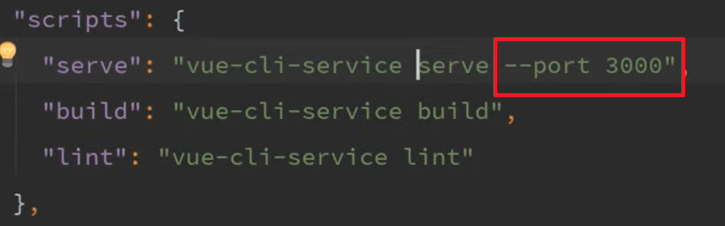
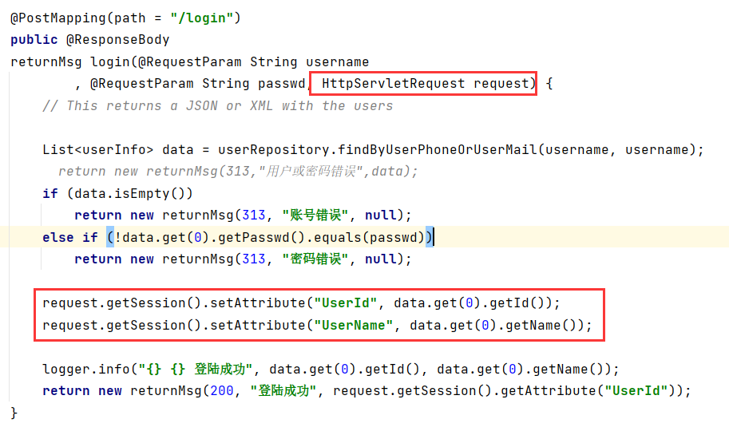

# 项目笔记

## SpringBoot

1. CORS，可以使用两种方法解决，这样就能前后端分离了。
2. @RestController + @GetMapping / @PostMapping 等等
3. 静态资源访问
4. 文件上传，使用表单，表单头：`<form action="/upload" method="post" enctype="multipart/form-data">`。SpringBoot中使用@RequestParam("file")这种来接受，file是name="file"对应的，文件使用：`@RequestParam("myfile") MultipartFile uploadFile`.
5. 多文件上传：`<input type="file" name="uploadFiles" value="please select some files" multiple>`。处理的时候参数为MultipartFile[] uploadFiles
6. input type="file" @change="onFileSelected"; onFileSelected(event){}.
7. 

以下两个等价：

```java
@GetMapping("/file")
public String getFile(@RequestParam("id") Integer id)
{
    return "you are asking for file " + id;
}

@GetMapping("/file/{id}")
public String getFile(@PathVariable Integer id)
{
    return "you are asking for file " + id;
}
```

主要就是@PathVariable和@RequestParam


java.sql.SQLSyntaxErrorException: Table 'db_example.hibernate_sequence' doesn't exist

这个报错解决方法：@Id, @GenerationValue(strategy=GenerationType.AUTO) => GenerationType.IDENTITY


还要检查服务器的端口是否被占用。

@RestController = @Controller + @ResponseBody


要在application.properties中加入`spring.jpa.hibernate.ddl-auto=create`才能自动创建表！

但是这样会创建一个新的表！！

https://blog.csdn.net/yidou120/article/details/104996998

应该用update


## Vue.js

vue 用下面的方法设置要使用的端口：




rest接口返回的数据就是response.data。

## Session

相关资料：




后端使用HttpServletRequest request，调用request.getSession()等

删除某个键值对：`session.removeAttribute(name);`

关于getSession:

```java
getSession(boolean create)意思是返回当前reqeust中的HttpSession ，如果当前reqeust中的HttpSession 为null，当create为true，就创建一个新的Session，否则返回null； 
简而言之： 
HttpServletRequest.getSession(ture)等同于 HttpServletRequest.getSession() 
HttpServletRequest.getSession(false)等同于 如果当前Session没有就为null；
当向Session中存取登录信息时，一般建议：HttpSession session = request.getSession();
当从Session中获取登录信息时，一般建议：HttpSession session = request.getSession(false);
```

如果想关闭session，使用：

```java
HttpSession session = request.getSession(false);
if (session != null) {
    session.invalidate();
}
```


使用nginx解决跨域问题。在本地跑的时候，这样就可以同域访问了。nginx将对前端的请求转发到前端，将对后端的请求转发到后端，这样前端访问后端的时候就访问后端的url就可以了，后端能够从session中获取存储的信息。
